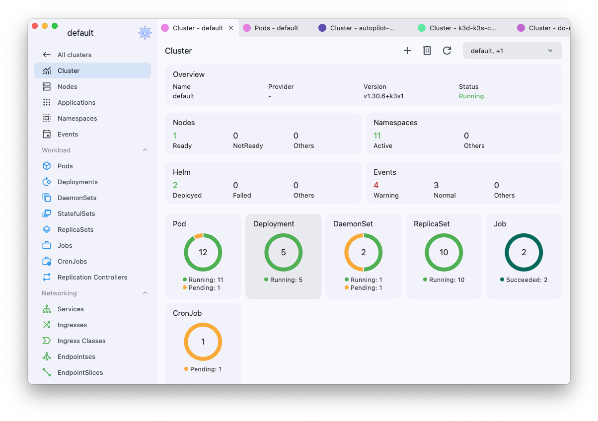

# Kubeterm

Kubeterm is a graphical management tool for kubernetes clusters.
It provides clear visibility into your clusters, enable users to manage cluster resource and applications easily, as well as perform troubleshooting actions.

As a local runnning application, kubeterm doesn't require anything installed into the cluster.
It supports multiple platforms, including desktop and mobile devices.

## Features

- **Cluster Access & Authentication:**
  - Automatically loads the default kubeconfig with zero configuration.  
  - Integrates with cloud provider accounts (GCP and Azure) to import clusters by simply logging in.  
  - Supports cloud provider credentials, including AWS secret access keys, GCP service accounts, and Azure service principals.  
  - Provides built-in OIDC authentication by reading the `auth-provider` field from the `user` section of the kubeconfig. [Example](https://github.com/kbterm/kubeterm/issues/9#issuecomment-2480673477)
- **Cluster dashboard:** View cluster status and resource metrics (requires kubernetes metrics server).
- **Resource Viewer:** List and describe detials of kubernetes resource, including custom resources.
- **Resource operations:** Create, edit and delete resource, as well as advanced operations such as scaling, restart, node cordon/uncordon/drain.
- **Debugging:**
  -  Debug Node or Pod by running an ephemeral container.
  -  Run commands directly inside containers.
  -  Inspect container's logs with searching, highlighting, tailing or downloading to local.
- **File transfer:** Copy files from/to Pod.
- **Port forwarding:** Forward local requests to Pod/Service.
- **Helm management:** Install, uninstall, upgrade and rollback Helm charts/releases.
- **Cross-platform support:** Available on both mobile and desktop.
- **Data sync:** Sync kubeconfig across multiple clients via iCloud (iOS/MacOS).

## Get started

- **Download for desktop (macOS and Windows):**

  👉 [Latest releases](https://github.com/kbterm/kubeterm/releases/latest)

- **Download for mobile devices:**

  
  

- **Download macOS version from App Store:**

  

  > ⚠️ **Note:** Due to Apple App Sandbox restrictions, the macOS version downloaded from the App Store does **not** support executing credential plugins in kubeconfig.  
  > If you need this functionality, please download the macOS version directly from [GitHub Releases](https://github.com/kbterm/kubeterm/releases/latest).

## FAQ

## Contact us

- Create and track [issues](https://github.com/kbterm/kubeterm/issues).
- Join us on [Discord](https://discord.gg/Jv4zEEBMR2).
- Follow us on [X](https://x.com/kubeterm).
