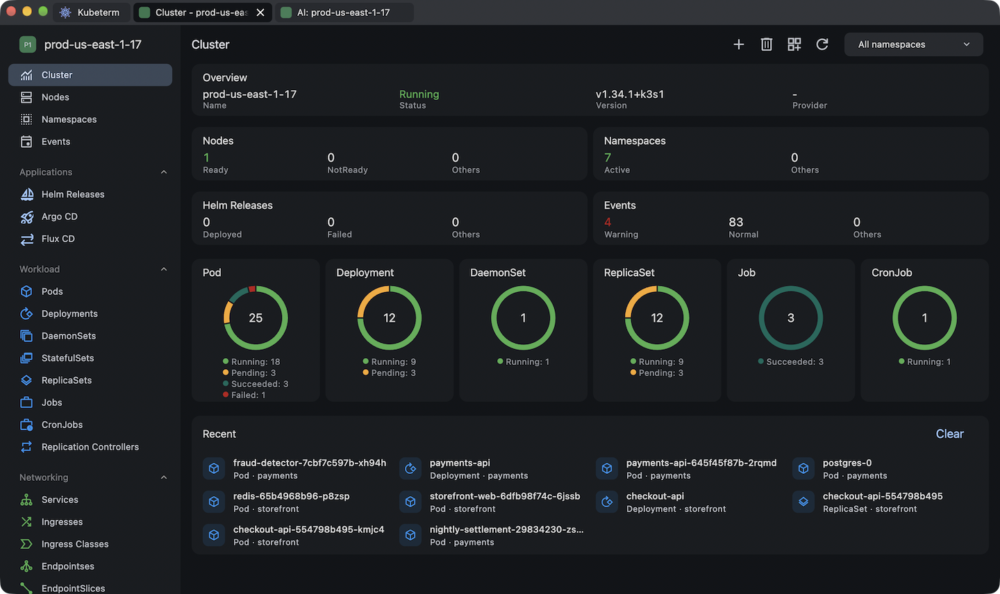

# Kubeterm

Kubeterm is a graphical management tool for kubernetes clusters.
It provides clear visibility into your clusters, enable users to manage cluster resource and applications easily, as well as perform troubleshooting actions.

As a local runnning application, kubeterm doesn't require anything installed into the cluster.
It supports multiple platforms, including desktop and mobile devices.


## Features

- **Cluster Access & Authentication:**
  - Automatically loads the default kubeconfig with zero configuration.  
  - Integrates with cloud provider accounts (GCP and Azure) to import clusters by simply logging in.  
  - Supports cloud provider credentials, including AWS secret access keys, GCP service accounts, and Azure service principals.  
  - Provides built-in OIDC authentication by reading the `auth-provider` field from the `user` section of the kubeconfig. [Example](https://github.com/kbterm/kubeterm/issues/9#issuecomment-2480673477)
- **AI Agent:**
  - Built-in AI assistant for Kubernetes troubleshooting and operations.
  - Works with cluster-aware context, including the selected cluster, resource details, YAML and log snippets.
  - Requires explicit approval before mutating cluster actions are executed.
- **Cluster dashboard:** View cluster status and resource metrics (requires kubernetes metrics server).
- **Resource Viewer:** List and describe detials of kubernetes resource, including custom resources.
- **Resource operations:** Create, edit and delete resource, as well as advanced operations such as scaling, restart, node cordon/uncordon/drain.
- **Debugging:**
  -  Debug Node or Pod by running an ephemeral container.
  -  Run commands directly inside containers.
  -  Inspect container's logs with searching, highlighting, tailing or downloading to local.
- **File transfer:** Copy files from/to Pod.
- **Port forwarding:** Forward local requests to Pod/Service.
- **Pod file browser:** — Open file browser on pod directly in the app.
- **Helm management:** Install, uninstall, upgrade and rollback Helm charts/releases.
- **Cross-platform support:** Available on both mobile and desktop.
- **Data sync:** Sync kubeconfig across multiple clients via iCloud (iOS/MacOS).


## Get started

### Mobile version

- **Download on your mobile devices:**

  <a href="https://apps.apple.com/us/app/kubeterm-kubernetes-client/id6450548861"></a>
  <a href='https://play.google.com/store/apps/details?id=com.kubeterm'></a>


### Desktop version (macOS, Windows and Linux)

- **Download from Github releases:**

  [Latest releases](https://github.com/kbterm/kubeterm/releases/latest)


- **Install macOS version by Homebrew:**

  ```
  brew install --cask kubeterm
  ```

- **Download macOS version from App Store:**

  <a href="https://apps.apple.com/us/app/kubeterm-kubernetes-client/id6450548861"></a>

  > ℹ️ Note: This build runs inside Apple's App Sandbox and therefore cannot execute credential plugins (exec blocks) referenced in your kubeconfig.
  > If you rely on these, use the direct macOS build instead — available from GitHub Releases or via Homebrew:


## AI Agent

Kubeterm includes a built-in AI Agent for Kubernetes operations and troubleshooting.
The agent runs inside Kubeterm, can work with the currently selected cluster or resource context, and helps investigate issues directly from the UI.


## FAQ


## Contact us

- Create and track [issues](https://github.com/kbterm/kubeterm/issues).
- Join us on [Discord](https://discord.gg/Jv4zEEBMR2).
- Follow us on [X](https://x.com/kubeterm).
